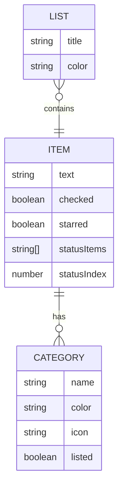

# efi To-Do

This app is a simple to-do list for efi.

The following is an entity-relationship diagram describing the data model.

```mermaid
erDiagram
LIST {
  string title
  string color
}
LIST }o--|| ITEM : contains

ITEM {
  string text
  boolean checked
  boolean starred
  string[] statusItems
  number statusIndex
}
ITEM ||--o{ CATEGORY : has

CATEGORY {
  string name
  string color
  string icon
  boolean listed
}
```
